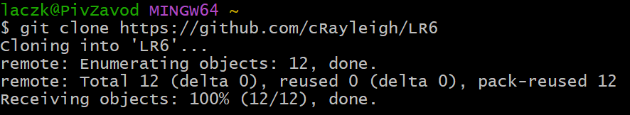
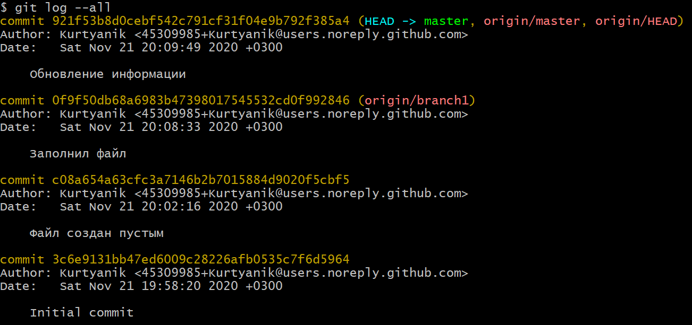
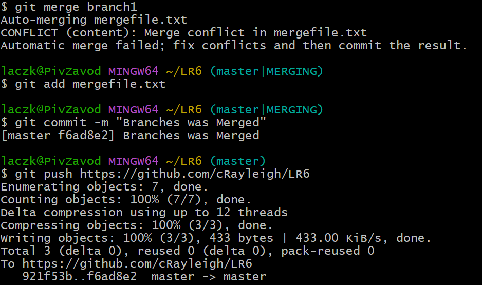
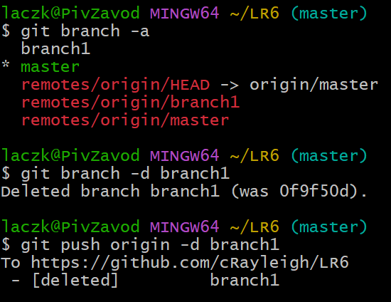
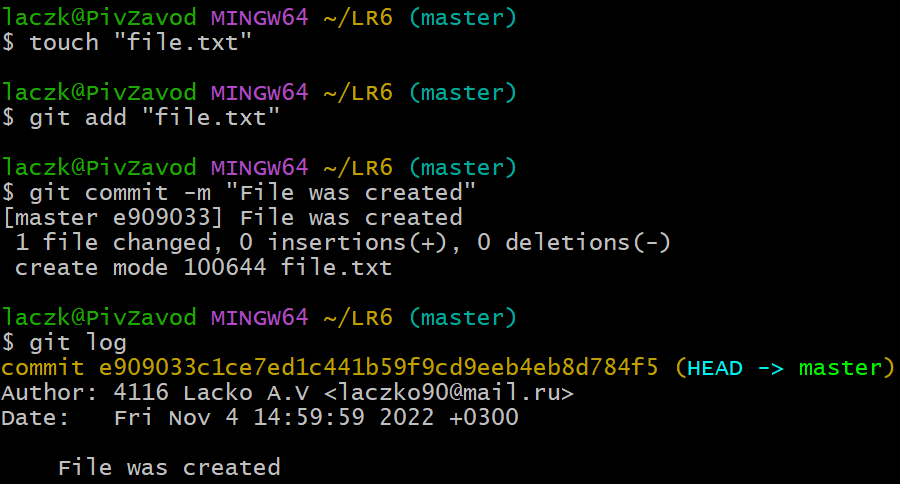
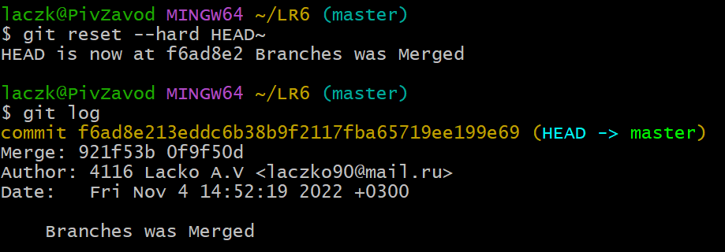
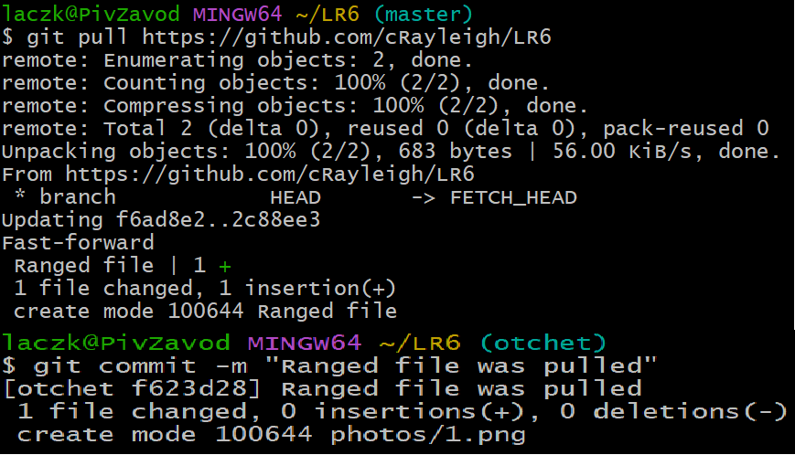
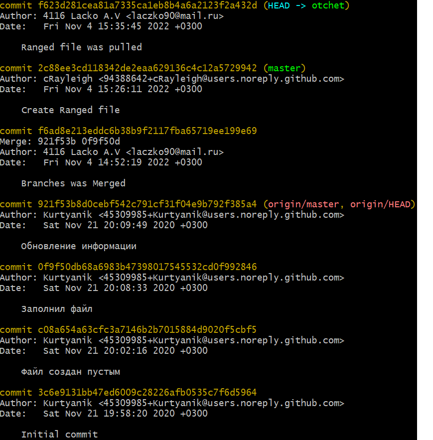

# LR6
Лабораторная работа №6

## Цель лабораторной работы 
изучение базовых возможностей системы управления версиями, опыт работы с Git Api, опыт работы с локальным и удаленным репозиторием.

## Ход работы
* Репозиторий был клонирован, с помощью команды git clone, также был настроен профиль 

* Просмотрена история всех веток в репозитории

* Слияение в ветку master, разрешив конфликт

* Удаление побочной ветки

* Создание тестового файла

* Удаление тестового файла

* Создание и скачивание файла из репозитория

* Вывод всех коммитов

## Вывод
В ходе лабораторной работы я изучил базовы возможности системой управления версиями, получил опыт работы с Git Api, опыт работы с локальным и удалённым репозиторием.